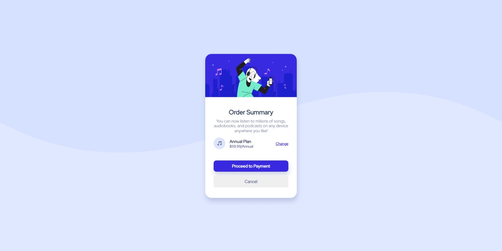

# Frontend Mentor - Order summary card solution

This is a solution to the [Order summary card challenge on Frontend Mentor](https://www.frontendmentor.io/challenges/order-summary-component-QlPmajDUj).
This solution is built using a [create-react-app](https://create-react-app.dev/) as a UI Library and using [styled-components](https://styled-components.com/)

## Table of contents

- [Overview](#overview)
  - [The challenge](#the-challenge)
  - [Screenshot](#screenshot)
  - [Links](#links)
- [My process](#my-process)
  - [Built with](#built-with)
- [Author](#author)

**Note: Delete this note and update the table of contents based on what sections you keep.**

## Overview

### Screenshot

### Links

- Solution URL: https://www.frontendmentor.io/challenges/order-summary-component-QlPmajDUj/hub/simple-summary-card-created-with-reactjs-and-styled-components-aXd4BucPrp)
- Live Site URL: https://savocks-order-summary-card.netlify.app/

## My process

### Built with

- Semantic HTML5 markup
- CSS custom properties
- Flexbox
- CSS Grid
- Mobile-first workflow
- [React](https://reactjs.org/) - JS library
- [Styled Components](https://styled-components.com/) - For styles

### What I learned
## Author

- Website - [Savocks](https://savocks.github.io/)
